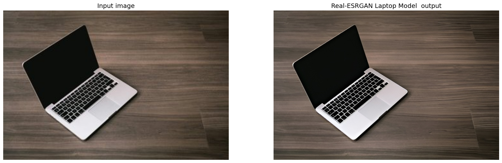
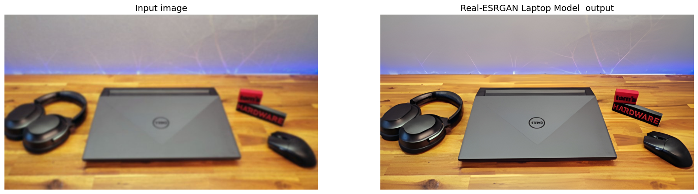

# Real-ESRGAN-Laptop-Model
Fine-tuned Real-ESRGAN ×2 model optimized for enhancing laptop screen images, improving clarity and detail.

## Features

- 2× super-resolution specifically for laptop screenshots

- Compact SRVGGNetCompact architecture for fast inference

- Custom degradation pipeline simulating realistic blur and noise

## Examples

  

## Usage

You can use this model with the Real-ESRGAN inference script:

##Configuration

All training and inference parameters are defined in:

configs/finetune_RealESRGAN_x2_LaptopCompact.yml

Feel free to modify degradation probabilities, network settings, or training schedule as required.
